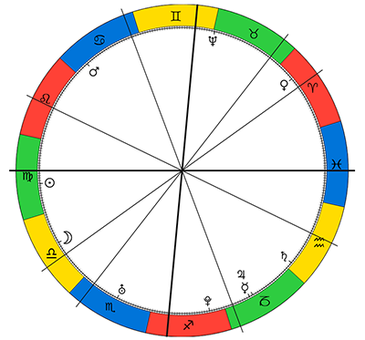

# Horoscope Drawer

HoroscopeDrawer.js lets you draw zodiac charts in SVG-Format.




## Getting Started (Example)

Draw a randomized horoscope:

```
const h = new zastro.Horoscope();
const drawn = h.draw("#horoscope");
console.log("Hurray! You have drawn your horoscope.", drawn);
```

Target selector shall be a svg-container in parent-html file:

```
<svg id="horoscope"></svg>
```

You can customize horoscope styles like in `/example/horoscope.css`.

## Build

Build the example page with:

```
gulp example-build
```

Outputs the source code files in the `/example` folder.

### Library

Build the library files with:

```
gulp build
```

Output will be placed in `/dist` folder.

## Features

* Zodiac 
* Planets
* Houses

### Planned
* Aspects (1.1.0)
* Transits (1.2.0)

## Built with

* Browserify
* Gulp
* SnapSVG

### License

(c) [Samuel Lissner](http://www.slissner.de)

